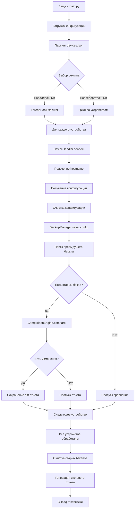

# **Network Configuration Backup & Compare Tool - Документация**

## **Общее описание**

Этот скрипт представляет собой **автоматизированную систему для резервного копирования конфигураций сетевых устройств** различных производителей (Cisco, Juniper, Huawei, Arista и др.) с последующим сравнением изменений между версиями конфигураций.

### **Основные возможности:**
- Поддержка **гетерогенных сетей** (разные вендоры и платформы)
- **Параллельная обработка** устройств для ускорения работы
- **Интеллектуальное сравнение** конфигураций с фильтрацией незначимых изменений
- **Автоматическое управление версиями** бэкапов
- **Подробное логирование** и отчетность
- **Валидация конфигурационных файлов** перед запуском

---

## **Архитектура проекта**

### **Структура файлов:**
```
network_backup_tool/
├── main.py                    # Главный скрипт - точка входа
├── validate_config.py         # Скрипт проверки конфигурации
├── config/                    # Конфигурационные файлы
│   ├── default.yaml          # Основные настройки приложения
│   ├── device_commands.yaml  # Словарь команд для разных типов устройств
│   └── devices.json          # Список устройств для бэкапа
└── src/                      # Исходный код приложения
    ├── __init__.py           # Маркер Python-пакета
    ├── models.py             # Модели данных (Data classes)
    ├── config_manager.py     # Менеджер конфигурации
    ├── device_handler.py     # Обработчик сетевых устройств
    ├── backup_manager.py     # Менеджер бэкапов
    └── comparison_engine.py  # Движок сравнения конфигураций
```

---

## **Детальное описание компонентов**

### **1. `models.py` - Модели данных**

**Назначение:** Определение структурированных типов данных для всего приложения.

**Ключевые классы:**
- **`DeviceConfig`**: Конфигурация подключения к устройству (IP, тип устройства, учетные данные и т.д.)
- **`BackupResult`**: Результат операции бэкапа (статус, путь к файлу, ошибки)
- **`CommandMapping`**: Сопоставление команд для конкретного типа устройства

**Логика:**
- Использует **dataclasses** для автоматической генерации методов
- Предоставляет методы преобразования в/из словарей
- Служит основой для типобезопасной работы во всем приложении

### **2. `config_manager.py` - Менеджер конфигурации**

**Назначение:** Централизованное управление всеми конфигурационными файлами.

**Основные функции:**

1. **Загрузка конфигурации:**
    - Чтение `default.yaml` с общими настройками
    - Загрузка `device_commands.yaml` с командами для каждого типа устройств
    - Парсинг `devices.json` со списком устройств

2. **Управление командами устройств:**
   ```python
   device_commands = {
       "cisco_ios": {
           "hostname_cmd": "show running-config | include hostname",
           "config_cmd": "show running-config",
           "hostname_pattern": r"hostname\s+(\S+)"
       },
       # ... другие типы устройств
   }
   ```

3. **Обработка шаблонов игнорирования:**
    - Фильтрация временных меток, комментариев и других незначимых строк
    - Разные шаблоны для разных типов устройств

4. **Глубокое слияние конфигураций:**
    - Объединение дефолтных и пользовательских настроек
    - Рекурсивное обновление словарей

### **3. `device_handler.py` - Обработчик сетевых устройств**

**Назначение:** Взаимодействие с сетевыми устройствами через SSH.

**Логика работы:**

1. **Установка соединения:**
   ```python
   # Использует Netmiko для абстракции различий между устройствами
   connection = ConnectHandler(
       device_type=device.device_type,
       host=device.host,
       username=device.username,
       password=device.password,
       port=device.port,
       secret=device.secret
   )
   ```

2. **Адаптация под разные платформы:**
    - Для Cisco IOS: вход в enable режим при наличии пароля
    - Для Juniper JunOS: автоматическое отключение постраничного вывода
    - Для Huawei VRP: отправка команды для отключения пагинации

3. **Получение конфигурации:**
    - Определение команды на основе типа устройства
    - Очистка вывода от ANSI escape-последовательностей
    - Удаление эхо-команд и лишних приглашений

4. **Очистка конфигурации:**
    - Удаление временных меток (`! Time: ...`)
    - Удаление комментариев коммитов (`## Last commit: ...`)
    - Фильтрация динамической информации

### **4. `backup_manager.py` - Менеджер бэкапов**

**Назначение:** Управление файловой системой для хранения бэкапов и отчетов.

**Функциональность:**

1. **Структура директорий:**
   ```
   backups/      # Конфигурационные файлы
   reports/      # Отчеты об изменениях
   logs/         # Логи выполнения
   ```

2. **Именование файлов:**
    - Формат: `{hostname}_{YYYY-MM-DD_HH-MM-SS}.conf`
    - Пример: `core-switch-01_2024-01-15_14-30-45.conf`

3. **Управление версиями:**
    - Поиск последнего бэкапа для каждого устройства
    - Автоматическая очистка старых бэкапов (сохранение N последних)
    - Группировка файлов по устройствам

4. **Сохранение отчетов:**
    - JSON-отчеты с общей статистикой
    - Учет успешных/неуспешных операций

### **5. `comparison_engine.py` - Движок сравнения**

**Назначение:** Выявление различий между версиями конфигураций.

**Алгоритм работы:**

1. **Предварительная обработка:**
    - Очистка обеих конфигураций от незначимых изменений
    - Применение фильтров, специфичных для типа устройства

2. **Сравнение с использованием `difflib.unified_diff`:**
   ```python
   diff = unified_diff(
       old_lines,           # Старая конфигурация (по строкам)
       new_lines,           # Новая конфигурация (по строкам)
       fromfile='Old Config',
       tofile='New Config',
       lineterm='',
       n=3                  # Количество контекстных строк
   )
   ```

3. **Анализ изменений:**
    - Определение значимых изменений (игнорирование временных меток)
    - Подсчет добавленных/удаленных строк
    - Генерация понятных отчетов с префиксами `+` и `-`

4. **Создание отчетов:**
    - Формат unified diff с заголовком
    - Временные метки и статистика изменений
    - Автоматическое сохранение только при наличии изменений

### **6. `main.py` - Основной скрипт**

**Назначение:** Координация работы всех компонентов и предоставление CLI.

**Логика выполнения:**

1. **Инициализация:**
   ```python
   tool = NetworkBackupTool(config_dir="config")
   ```

2. **Загрузка устройств:**
   ```python
   devices = config_manager.load_devices()  # Из devices.json
   ```

3. **Режимы выполнения:**
    - **Последовательный:** Подходит для отладки, стабильное выполнение
    - **Параллельный:** Использует `ThreadPoolExecutor` для ускорения

4. **Обработка устройств:**
   Для каждого устройства:
    1. Подключение по SSH
    2. Получение hostname и конфигурации
    3. Очистка конфигурации
    4. Сохранение в файл
    5. Сравнение с предыдущей версией
    6. Генерация отчета при изменениях

5. **Формирование итогов:**
    - Статистика успешных/неуспешных бэкапов
    - Очистка старых версий
    - Сохранение логов и отчетов

### **7. `validate_config.py` - Валидатор конфигурации**

**Назначение:** Проверка корректности конфигурационных файлов перед запуском.

**Проверяемые аспекты:**

1. **Структура файлов:**
    - Существование обязательных файлов
    - Корректность форматов (YAML/JSON)

2. **Содержание:**
    - Обязательные поля в конфигурации устройств
    - Корректность регулярных выражений
    - Валидность портов и других числовых параметров

3. **Согласованность:**
    - Проверка, что все типы устройств из `devices.json` определены в `device_commands.yaml`
    - Валидность шаблонов для извлечения hostname

---

## **Поток данных**



---

## **Особенности реализации**

### **Поддержка гетерогенных сетей:**
1. **Абстракция через Netmiko:** Единый API для разных вендоров
2. **Конфигурируемые команды:** Каждый тип устройства имеет свой набор команд
3. **Адаптивная очистка:** Разные фильтры для разных платформ

### **Обработка ошибок:**
1. **Изоляция сбоев:** Ошибка на одном устройстве не прерывает работу с другими
2. **Детальное логирование:** Все операции и ошибки записываются в лог
3. **Грейсфул деградейшн:** При отсутствии команды для типа устройства используется fallback

### **Производительность:**
1. **Параллельная обработка:** Использование пула потоков
2. **Ленивая загрузка:** Конфигурация загружается только при необходимости
3. **Кэширование соединений:** Повторное использование подключений где возможно

### **Безопасность:**
1. **Разделение кода и конфигурации:** Учетные данные хранятся отдельно
2. **Валидация входных данных:** Проверка всех конфигурационных файлов
3. **Безопасное хранение:** Очистка чувствительной информации из логов

---

## **Пример рабочего процесса**

### **1. Подготовка:**
```bash
# Создание образцовой конфигурации
python validate_config.py --create-samples

# Редактирование файлов
vim config/devices.json        # Добавление устройств
vim config/device_commands.yaml # Добавление нового типа устройства
```

### **2. Валидация:**
```bash
# Проверка корректности конфигурации
python validate_config.py

# Тестовый запуск
python main.py --test
```

### **3. Запуск:**
```bash
# Полный бэкап (параллельный режим)
python main.py --workers 10

# Последовательный режим (для отладки)
python main.py --sequential

# С кастомной конфигурацией
python main.py --config /path/to/config
```

### **4. Анализ результатов:**
```
backups/
├── core-switch-01_2024-01-15_14-30-45.conf
├── router-juniper_2024-01-15_14-31-10.conf
└── ...

reports/
├── CHANGES_core-switch-01_2024-01-15_14-30-45.diff
├── summary_20240115_143112.json
└── ...

logs/
└── backup_20240115.log
```

---

## **Расширяемость**

### **Добавление нового типа устройства:**
1. Добавить команды в `config/device_commands.yaml`:
   ```yaml
   new_device_type:
     hostname_cmd: "command_to_get_hostname"
     config_cmd: "command_to_get_config"
     hostname_pattern: "regex_pattern"
     disable_paging: true/false/"command"
   ```

2. Добавить шаблоны игнорирования в `config/default.yaml`:
   ```yaml
   comparison:
     ignore_patterns:
       new_device_type:
         - "^# Dynamic data pattern.*"
   ```

3. Использовать новый тип в `config/devices.json`:
   ```json
   {
     "host": "192.168.1.10",
     "device_type": "new_device_type",
     "username": "admin"
   }
   ```

### **Кастомизация логики:**
- **Новые форматы отчетов:** Наследование от `ComparisonEngine`
- **Альтернативные хранилища:** Реализация собственного `BackupManager`
- **Дополнительные проверки:** Расширение `validate_config.py`

---

## **Критические компоненты для отладки**

### **Проблемы с подключением:**
1. Проверить `logs/backup_*.log` на ошибки аутентификации
2. Убедиться, что тип устройства поддерживается Netmiko
3. Проверить доступность устройств и корректность портов

### **Некорректное получение конфигурации:**
1. Проверить команды в `device_commands.yaml`
2. Убедиться в правильности фильтров очистки
3. Проверить обработку пагинации для данного типа устройства

### **Проблемы со сравнением:**
1. Убедиться, что фильтры игнорирования корректны
2. Проверить кодировку файлов (должна быть UTF-8)
3. Убедиться, что очистка конфигурации работает правильно

---